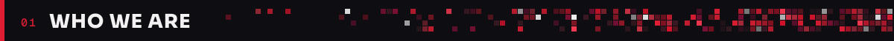
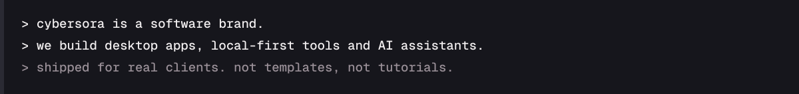

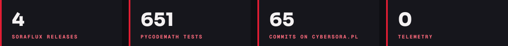

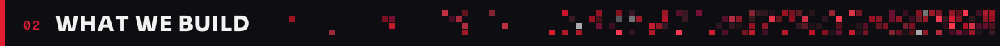

<table>
<tr>
<td width="50%"><a href="https://github.com/cybersora9/soraflux">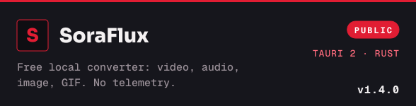</a></td>
<td width="50%"><a href="https://github.com/cybersora9/pycodemath">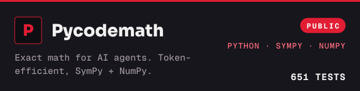</a></td>
</tr>
<tr>
<td width="50%"><a href="https://cybersora.pl">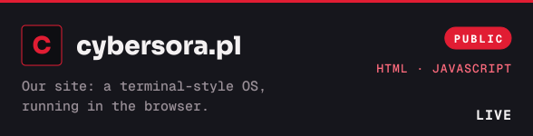</a></td>
<td width="50%">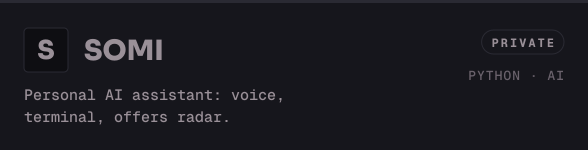</td>
</tr>
<tr>
<td width="50%">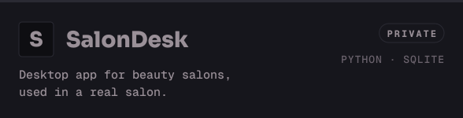</td>
<td width="50%">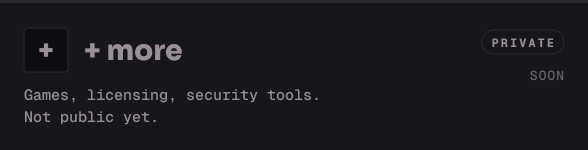</td>
</tr>
</table>

<table>
<tr>
<td width="50%"></td>
<td width="50%"><a href="https://cybersora.pl">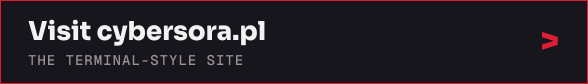</a></td>
</tr>
</table>

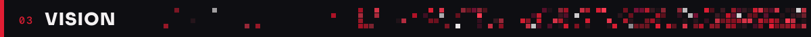
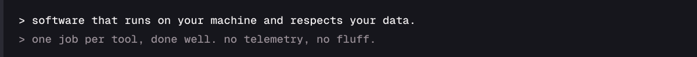

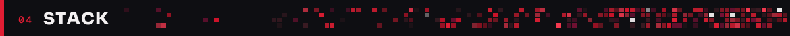
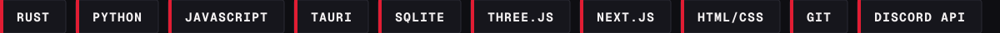

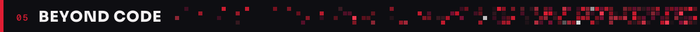
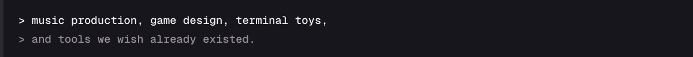

<a href="https://cybersora.pl"></a>
