## `WHO I AM`

Hey, I'm **Cybersora**, a solo developer from Gorlice, Poland. I build desktop apps, local-first tools and AI assistants, and I ship them under my own brand: [cybersora.pl](https://cybersora.pl). Not a template, not a tutorial: real software for real people.

## `WHAT I DO`

| | Project | What it is |
|---|---|---|
| 🎞️ | [**SoraFlux**](https://github.com/cybersora9/soraflux) | Free, local video / audio / image / GIF converter. Tauri 2 + Rust, no telemetry. |
| ∑ | [**Pycodemath**](https://github.com/cybersora9/pycodemath) | Token-efficient exact math for AI agents. SymPy + NumPy, ODE suite, optimizer, code generator. |
| 🌐 | [**cybersora.pl**](https://github.com/cybersora9/cybersora-pages) | My site: a terminal-style OS in the browser. |
| 🤖 | **SOMI** | Personal AI assistant with voice, terminal and an offers radar. *(private)* |
| 💈 | **SalonDesk** | Desktop app for beauty salons, running in a real salon. *(private)* |

## `VISION`

Software that runs on your machine, respects your data and does one job well. Small team, high standards, zero fluff.

## `STACK`

## `BEYOND CODE`

Music production, game design, and building tools I wish existed.

